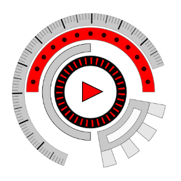

English | <a href="readme.ru.html">Русский</a>

***

# Round Interfaces Library

Round Interfaces Library is a collection of graphic objects classes for building round user interfaces.  

## Library Purpose 

Round interfaces can be used to:  

* diversify the design of a project or product;  
* provide compactness when visualizing information;  
* get a virtual version of the physical control interfaces or measuring instruments.  

This library is being developed to simplify the process of designing and implementing round interfaces.  

For example, a key element of a round interface - segment of ring - can be created with a few lines of code:  

>
    HTML:  
>>
    <canvas id="segment" width="200" height="200">
        
Use a canvas-compatible browser

    </canvas>
>
    JS:  
>>
    let canvas = document.getElementById('segment');
    let context = canvas.getContext('2d');
    context.width = canvas.width;
    context.height = canvas.height;
    let cx = context.width/2;
    let cy = context.height/2;
>>
*let seg = new Segment('seg-1', context, cx, cy, 50, 20, -90, 90);*  
*seg.draw();*  

## Tools  

The library is written in JavaScript.  
To render graphic elements, the HTML Canvas is used.  

The documentation in English and Russian is supplied as part of the library in HTML and Markdown formats.  
To use the library, you need basic knowledge of HTML and JavaScript.  

## Structure of project files and folders  

> *js* - main folder with library files. To use the library in your own project, just connect these files.  

> *docs* - main user documentation folder. The documentation is provided in HTML format.    
> *docs-dev* - documentation in MD format for revision and use in your own projects.  

> *examples* - a folder with examples of using basic graphic objects.  
> *gui-examples-js* - a folder with examples of implementation of user interfaces composed of basic graphic objects.  

<a href="examples/gui-examples.html" target="_blank">Examples</a> describe how to build the shape and animation of round interfaces.  

> *css* - folder with styles for examples.  
> *svg* - folder with vector images for examples.  

## Basic elements of round interfaces (implemented in the version 1.0 of the library)

1. <a href="docs/segment.html">Segment</a>  
2. <a href="docs/segment-level.html">SegmentLevel</a>  
3. <a href="docs/segment-array.html">SegmentArray</a>  
4. <a href="docs/segment-dot.html">SegmentDot</a>  
5. <a href="docs/segment-dots-array.html">SegmentDotsArray</a>  
6. <a href="docs/segment-scale-mark.html">SegmentScaleMark</a>  
7. <a href="docs/segment-scale.html">SegmentScale</a>  
8. <a href="docs/segment-gradient.html">SegmentGradient</a>  
9. <a href="docs/utilities.html">Utilities</a>  

## Round controls (planned for development in the 2nd version of the library)  

1. Progress Bar  
2. Timer  
3. Volume  
4. Equalizer  
5. Captcha
6. Measuring Instruments
7. Chart
8. Radar

## Round controls for graphics management (planned for development in the 3rd version of the library)  

1. Icon Manager  
2. Image Gallery  
3. Round Interfaces Editor  

## License  
This library can be used and modified for commercial, educational and personal purposes.  
Error messages and recommendations for improvement can be sent to the author's email.  

## About Library
Version: 1.0

## About Author  
Author: Igor Tiunov  
E-mail: igor@tiunovvs.com  