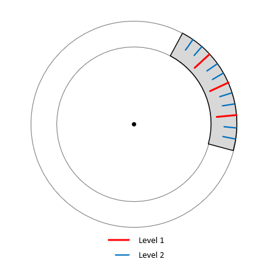

<a href="../readme.html">Home</a> → Segment Scale  

***

# SegmentScale

## Содержание
1. [Object description](#description)  
2. [Object creation](#constructor)  
3. [Examples] (#examples)  
4. [Properties](#properties)  
5. [Methods](#methods)  
6. [Events](#events)  

##Object description

Segment Scale is an a round measuring scale (Fig. 1).  

  
Fig. 1 - Segment Scale Geometry.  

##Object creation  

To create an object, the main parameters are passed to the constructor function. These parameters are used to create the base segment:  
>
*id* - segment scale identificator as a text string.  
*context* - CanvasRenderingContext2D for drawing a segment scale.  
*cx* - X coordinate of the base segment center.  
*cy* - Y coordinate of the base segment center.  
*r_in* - base segment inner radius.  
*thickness* - thickness of the base segment.  
*init_angle* - the initial angle of the base segment in degrees. May take negative values. 
*angle* - angle of the base segment in degrees.  

##Examples  
<a href="../examples/segment-scale-examples.html" target="_blank">Examples</a> of using various properties and methods of the object.  

##Properties

### Base Segment Style  
>
*gradient* - base segment fill gradient. Type of value is <a href="segment-gradient.html">SegmentGradient</a>.   
*background* - base segment fill color (applies if fill gradient is not specified).  
*border_width* - base segment border width.  
*border_color* - base segment border color.  

The borders of the base segment can be set separately using direct access to the base segment through the *base_segment* property.  

### Scale Parameters  
>
*levels* - an array of levels of scale marks. Sets as a JSON array.  
Each level of marks is set as a JSON object, in which the keys are the following parameters:  
>>
_"divisions_count"_ - count of divisions.  
_"mark_length"_ - length of marks.  
_"mark_width"_ - width of marks.  
_"mark_color"_ - color of marks.  

>
For example, the following array of levels will break the scale in Figure 2.  
First, the scale breaks into 4 divisions by red marks with a length of 8 and a width of 1.  
Then each of these divisions will also be divided into 4 divisions by marks of dark gray color with a length of 5 and a width of 1.  
>> [  
>>> { 'divisions_count' : 4, 'mark_length' : 8, 'mark_width' : 1, 'mark_color' : 'rgba(255, 0, 0, 1)' },  
>>> { 'divisions_count' : 4, 'mark_length' : 5, 'mark_width' : 1, 'mark_color' : 'rgba(64, 64, 64, 1)' } 

>> ]  

  
Fig. 2 - Segment Scale with two levels of marks.  

>
*mark_position* - position of scale marks. Valid values:  
>> _"inner"_ - adjoining the inner border of the base segment.  
>> _"middle"_ - location in the middle of the base segment.  
>> _"outer"_ - adjoining the outer border of the base segment.  

>
*mark_r_in* - scale marks inner radius. Ignored if property *mark_position* is set.  

### Segment Scale Flags
>
*visible* - value *true* ensures object visibility.  
*marks_visible* - value *true* ensures scale marks visibility.  
*in_progress* - flag takes the value *true* during the animation.  

##Methods

> *build()* - performs basic calculations of the shape and style of the base segment and scale marks, taking into account the specified properties and flags.  

> *draw()* - draws an object.  

> *instanceCopy()* - creates an independent copy of the object.  

### Segment Scale Animation

Segment Scale animation is various changes in the shape, position, or style of the scale marks over time.  

Key animation parameters:  
> *duration* - animation duration. Sets in seconds.  
> *delay* - delay before the start of the animation. Sets in seconds.  
> *direction* - animation direction. Valid values ​​depend on the type of animation.  
> *order* - animation order. Valid values:  
>> _"together"_  
>> _"one-by-one-clockwise"_  
>> _"one-by-one-anticlockwise"_  
>> _"level-by-level-clockwise"_  
>> _"level-by-level-anticlockwise"_  
>> In case of *one-by-one* order the *duration* will be divided evenly between the array elements, taking into account the *lag* between animation of array elements.  

> *lag* - lag between animation of array elements. Sets in seconds.  

#### Animation Methods

> *appear(order, lag, direction, duration, delay)* - appearance of the scale marks due to a gradual change in their shape.  
>> The *direction* parameter can take values ​​that are valid for a similar method of <a href="segment-scale-mark.html">SegmentScaleMark</a>.  
>> If all scale marks appear, then the event *segment-scale-appeared* dispatches.  

> *disappear(direction, duration, delay)* - disappearance of the scale marks due to a gradual change in their shape.  
>> The *direction* parameter can take values ​​that are valid for a similar method of <a href="segment-scale-mark.html">SegmentScaleMark</a>.  
>> If all scale marks appear, then the event *segment-scale-disappeared* dispatches.

> *fadeIn(order, lag, duration, delay)* - gradual appearance of the scale marks due to a change in their transparency.  
>> If all scale marks appear using fading, then the event *segment-scale-faded-in* dispatches.  

> *fadeOut(order, lag, duration, delay)* - gradual disappearance of the scale marks due to a change in their transparency.
>> If all scale marks disappear using fading, then the event *segment-scale-faded-out* dispatches.  

##Events

Events triggered by a SegmentScale are implemented using a CustomEvent.  
In the *detail.scale* field, a link to the object itself is passed.  

> *segment-scale-changed* - event dispatches if one of the scale marks or the base segment is changed.  

> *segment-scale-appeared*  
> *segment-scale-disappeared*  
> *segment-scale-faded-in*  
> *segment-scale-faded-out*  

***

<a href="../readme.html">Home</a> → Segment Scale  